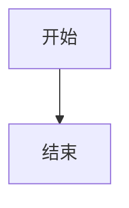
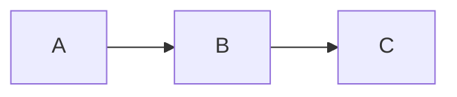

# README

# Lichtung 主题文档

> 简洁而功能丰富的 Hugo 主题。
> 主题名称来自海德格尔哲学概念"Lichtung"（林中空地）——在知识的森林中开辟一片被光照亮的空间。

## 快速开始

### 使用 exampleSite

```bash
# 进入 exampleSite 目录
cd themes/lichtung/exampleSite

# 直接启动 Hugo 服务器
hugo server
```

### 在新站点中使用主题

```bash
# 创建新站点
hugo new site my-site

# 将主题克隆到 themes 目录
cd my-site/themes
git clone https://github.com/hiraethecho/lichtung.git

# 复制配置
cp lichtung/exampleSite/hugo.toml ../hugo.toml

# 创建内容
hugo new posts/my-first-post.md
```

---

## 配置说明

### hugo.toml vs local.toml

Lichtung 主题的实际使用者——**memex** 站点——维护了两份配置文件：

| 文件         | 作用                                 |
| ------------ | ------------------------------------ |
| `hugo.toml`  | 主配置文件，提交到 Git，用于生产部署 |
| `local.toml` | 本地开发覆盖配置，**不提交**到 Git   |

Hugo 会自动合并 `hugo.toml` 和 `local.toml`，后者优先级更高。这是一种常见的最佳实践：

- `hugo.toml` 中开启所有评论系统（waline、giscus、cwd）
- `local.toml` 中关闭一些服务（如 `cwd = false`）以避免本地开发时不必要的网络请求

示例差异：

```toml
# hugo.toml（生产）
cwd = true
ShowSectionCountWords = false

# local.toml（本地开发）
cwd = false               # 本地不加载 CWD 评论
ShowSectionCountWords = true
walineshow = true         # 本地新增 waline 显示控制（hugo.toml 中没有这个字段）
```

### 站点基本信息

| 配置项                   | 说明                                                       | 示例值                   |
| ------------------------ | ---------------------------------------------------------- | ------------------------ |
| `baseURL`                | 站点域名                                                   | `'https://example.com/'` |
| `title`                  | 站点标题                                                   | `'MEMEX'`                |
| `theme`                  | 主题名称（必须为 `'lichtung'`）                            | `'lichtung'`             |
| `hasCJKLanguage`         | 是否包含中日韩文字。开启后 Hugo 正确计算中文字数和阅读时间 | `true`                   |
| `enableGitInfo`          | 在页面底部显示 Git 最后修改时间和提交链接                  | `true`                   |
| `defaultContentLanguage` | 默认内容语言                                               | `'zh-cn'`                |

### 自定义输出格式

```toml
[outputs]
home = ["HTML", "RSS", "JSON", "CROSSLINKS"]

[outputFormats.crosslinks]
mediaType = 'application/json'
baseName = 'crosslinks'
isPlainText = true
notAlternative = true
weight = 1
```

`CROSSLINKS` 是 Lichtung 独有的输出格式。它配合 `render-link.crosslinks.json` 钩子工作：在构建站点时遍历所有页面间的内部链接，生成一个 JSON 文件，用于在文章侧边栏显示"出链"和"入链"。

> **注意**：CROSSLINKS 只写入首页的 output，所以 `[outputs]` 下面声明 `home` 的 output，而非 `[outputFormats]`。

### 分类系统

Lichtung 支持 Hugo 原生的 taxonomy 系统：

```toml
[taxonomies]
tag = 'tags'           # 标签：单篇可多个
category = 'categories' # 分类：单篇可多个
series = 'series'       # 系列：多篇组成的系列文章
topic = 'topics'        # 主题：更高层级的分类
genre = 'genres'        # 体裁：议论、叙事、抒情等
```

每个 taxonomy 会生成独立页面（如 `/tags/`、`/categories/`），列出所有 term。每个 term 也有独立页面（如 `/tags/hugo/`），显示该标签下的所有文章。

#### Taxonomy 模板

| 模板                    | 作用                                               |
| ----------------------- | -------------------------------------------------- |
| `layouts/taxonomy.html` | 分类列表页（如 `/tags/`），显示所有术语            |
| `layouts/term.html`     | 分类术语页（如 `/tags/hugo/`），显示该术语下的文章 |

### 站点参数详解

所有主题功能通过 `[params]` 下的参数控制。以下按功能分组说明。

#### 站点信息

```toml
[params]
subtitle = 'Es Muss Sein'                # 副标题，显示在顶栏标题下方
description = '隐蔽而开放的赛博角落'       # 站点描述，显示在侧边栏
author = { name = 'Hiraeth', email = 'wyz2016zxc@outlook.com' }
StartDate = '2023/06/23'                # 建站日期，侧边栏显示"已运行 X 天"
```

#### 通用选项

| 参数               | 默认值         | 说明                                           |
| ------------------ | -------------- | ---------------------------------------------- |
| `DateFormat`       | `'2006/01/02'` | 日期显示格式（Go 时间格式）                    |
| `ShowContentinRSS` | `true`         | RSS 中是否包含全文（`false` = 仅摘要）         |
| `comment`          | `true`         | 全局评论开关，单篇可覆盖                       |
| `math`             | `false`        | 全局 MathJax 开关，单篇可覆盖                  |
| `LastChangeLink`   | `''`           | Git 提交历史链接前缀（用于显示"最后修改"链接） |

#### 评论系统

Lichtung 目前支持四种评论系统。用 radio 按钮切换。

| 系统       | 配置参数                                               | 说明                         |
| ---------- | ------------------------------------------------------ | ---------------------------- |
| **CWD**    | `cwd`, `cwdurl`, `cwdsiteid`, `cwdlang`, `cwdpostslug` | 自部署轻量评论系统           |
| **Waline** | `waline`, `walineserver`                               | 基于 LeanCloud 的评论系统    |
| **Twikoo** | `twikoo`, `twikooenvId`, `twikoojs`                    | 腾讯云/Zeabur 部署的评论系统 |
| **Giscus** | `giscus`, `gcsdata`                                    | 基于 GitHub Discussions      |

```toml
# Waline
waline = true
walineserver = 'https://your-server.example.com'

# Giscus（完整配置）
giscus = true
gcsdata = {
  repo = "user/repo",
  repoid = "R_kgDOxxx",
  category = "General",
  categoryid = "DIC_kwxxx",
  mapping = "title",
  position = "top",
  lang = "zh-CN"
}
```

> **注意（来自实际使用经验）**：LeanCloud 和 Zeabur 的免费层可能会停止服务导致 Waline/Twikoo 不可用。Giscus 依赖 GitHub 较为稳定。

#### 侧边栏组件

每个组件有独立的开关：

| 参数                 | 默认值       | 说明                       |
| -------------------- | ------------ | -------------------------- |
| `ShowSiteSearch`     | `true`       | 搜索框                     |
| `SearchContent`      | `true`       | 搜索索引是否包含正文       |
| `SearchPlaceHolder`  | `'Search ↵'` | 搜索框占位文字             |
| `ShowTaxonomyTree`   | `true`       | 分类树                     |
| `ShowFileTree`       | `true`       | 文件树                     |
| `ShowSiteNav`        | `true`       | 侧边栏导航（`menus.side`） |
| `ShowSiteInfo`       | `true`       | 站点信息面板               |
| `ShowSiteCountWords` | `true`       | 显示全站字数/篇数          |
| `ShowSiteCountTerms` | `true`       | 显示全站分类统计           |
| `ShowSiteLink`       | `false`      | 外部链接列表               |

#### 页面列表选项

控制首页、栏目页、标签页中的文章列表显示方式：

| 参数             | 说明           | 可选值                                   |
| ---------------- | -------------- | ---------------------------------------- |
| `ListType`       | 列表样式       | `'plain'`, `'date'`, `'list'`, `'split'` |
| `ListLimit`      | 每页文章数上限 | 数字或空（不限）                         |
| `ShowList`       | 是否显示列表   | `true`, `false`                          |
| `ShowSubSection` | 是否显示子栏目 | `true`, `false`                          |

**ListType 详解**：

- **`plain'`**（默认）：文章卡片列表，显示标题、日期、摘要、标签，无额外分组
- **`date'`**：按年月分组显示（归档风格），附带年份侧边栏快速导航。右侧出现折叠的年份/月份菜单，点击可跳转到对应位置
- **`list'`**：极简列表——只有标题和日期
- **`split'`**：分页显示，底部分页导航

**ListType 为 `date'` 时可用的子选项**：

| 参数                     | 说明                         |
| ------------------------ | ---------------------------- |
| `ShowCountWordsPerYear`  | 每年标题旁显示该年字数和篇数 |
| `ShowCountWordsPerMonth` | 每月标题旁显示该月字数和篇数 |
| `ShowPostsPerYear`       | 每年标题旁显示篇数           |
| `ShowPostsPerMonth`      | 每月标题旁显示篇数           |

#### 页面/文章选项

| 参数               | 默认值 | 说明                           |
| ------------------ | ------ | ------------------------------ |
| `ShowToc`          | `true` | 是否显示文章目录               |
| `ShowRelPost`      | `true` | 是否显示相关文章               |
| `HugoRelPost`      | `true` | 是否使用 Hugo 内置相关内容引擎 |
| `HugoRelPostLimit` | `10`   | 相关文章数量上限               |
| `ShowForwardLink`  | `true` | 是否显示"出链"                 |
| `ShowBackLink`     | `true` | 是否显示"入链"                 |

#### 首页选项

| 参数                 | 默认值  | 说明                                     |
| -------------------- | ------- | ---------------------------------------- |
| `ShowAllPagesInHome` | `false` | `false` = 只显示 `mainSections` 中的文章 |
| `ShowHeatMap`        | `true`  | 关于页面显示热力图                       |

`mainSections` 定义首页显示哪些栏目的文章：

```toml
mainSections = ['glade']   # 首页只显示 glade 栏目的文章
```

#### 归档页选项

| 参数                    | 默认值 | 说明                                         |
| ----------------------- | ------ | -------------------------------------------- |
| `ShowAllPagesInArchive` | `true` | `true` = 显示所有文章（不限 `mainSections`） |

#### 其他

| 参数               | 默认值                           | 说明                             |
| ------------------ | -------------------------------- | -------------------------------- |
| `PostPerTermLimit` | `5`                              | 分类页每个 term 展示的文章数上限 |
| `fuseOpts`         | `{ limit = 5, threshold = 0.1 }` | Fuse.js 搜索配置                 |

#### 外部链接与社交链接

```toml
# 侧边栏链接列表（需 ShowSiteLink = true）
[[params.links]]
name = '文档'
url = 'https://docs.example.com'
description = '技术文档'

# 社交图标（显示在侧边栏底部）
[[params.social]]
name = 'github'
url = 'https://github.com/username'
icon = 'github'

[[params.social]]
name = 'rss'
url = '/index.xml'
icon = 'rss'
```

可用的 `icon` 值定义在 `data/icons.yaml` 中，包括：`github`、`bilibili`、`codeberg`、`gitlab`、`bitbucket`、`hugo`、`rss`、`mail` 等 Heroicons v1 图标。

### 菜单

```toml
[menus]
# 顶栏主菜单
[[menus.main]]
name = '文章'
url = '/posts'
weight = 10

# 含子菜单的顶栏菜单
[[menus.main]]
name = '分类'
identifier = 'tax'
weight = 20

[[menus.main]]
name = '标签'
parent = 'tax'
url = '/tags'
weight = 1

# 侧边栏菜单（需 ShowSiteNav = true）
[[menus.side]]
name = '链接'
url = '/links'
weight = 10
```

`menus.main` 显示在顶栏，`menus.side` 显示在侧边栏（需 `ShowSiteNav = true`）。菜单支持无限层级嵌套（`parent` + `identifier`）。

### Markdown 渲染选项

```toml
[markup]
  [markup.tableOfContents]
  endLevel = 5              # 目录显示到第几级标题
  startLevel = 2            # 目录从第几级开始

  [markup.goldmark]
    [markup.goldmark.extensions]
    definitionList = true   # 定义列表
    table = true            # 表格
    taskList = true         # 任务列表

    [markup.goldmark.extensions.extras]
    [markup.goldmark.extensions.extras.delete]
    enable = true           # ~~删除文本~~
    [markup.goldmark.extensions.extras.insert]
    enable = true           # ++插入文本++
    [markup.goldmark.extensions.extras.mark]
    enable = true           # ==标记文本==
    [markup.goldmark.extensions.extras.subscript]
    enable = true           # ~下标~
    [markup.goldmark.extensions.extras.superscript]
    enable = true           # ^上标^

    [markup.goldmark.extensions.passthrough]
    enable = true           # MathJax 数学公式
    [markup.goldmark.extensions.passthrough.delimiters]
    block = [['\[', '\]'], ['$$', '$$']]
    inline = [['\(', '\)']]

    [markup.goldmark.parser.attribute]
    block = true            # 块级属性 {#id .class}
    title = true            # 行内属性

    [markup.goldmark.renderer]
    unsafe = true            # 允许 HTML（主题必须）
```

---

## 布局系统

Lichtung 包含以下布局模板：

| 模板文件               | 用途                                       | 触发条件                     |
| ---------------------- | ------------------------------------------ | ---------------------------- |
| `baseof.html`          | 基础骨架：header + sidebar + main + footer | 所有页面                     |
| `home.html`            | 首页                                       | `_index.md` 或根目录         |
| `page.html`            | 单篇文章                                   | 普通页面（`Kind = page`）    |
| `section.html`         | 栏目页                                     | 栏目索引（`Kind = section`） |
| `taxonomy.html`        | 分类列表页                                 | `/tags/`、`/categories/` 等  |
| `term.html`            | 分类术语页                                 | `/tags/hugo/` 等             |
| `about.html`           | 关于页面（含热力图）                       | `layout: about`              |
| `archive.html`         | 归档页面                                   | `layout: archive`            |
| `indexes.html`         | 站点索引页面                               | `layout: indexes`            |
| `404.html`             | 404 页面                                   | 访问不存在页面               |
| `rss.xml`              | RSS 订阅                                   | `.xml` 后缀访问              |
| `index.json`           | 搜索索引 JSON                              | Fuse.js 搜索                 |
| `home.crosslinks.json` | 交叉链接数据                               | CROSSLINKS 输出格式          |

### 布局选择示例

```yaml
# 普通文章（使用 page.html）
---
title: 我的文章
---
# 使用 about 布局（显示热力图）
---
title: 关于
layout: about
---
# 使用 archive 布局
---
title: 归档
layout: archive
---
# 使用 indexes 布局（搜索+索引+筛选）
---
title: 索引
layout: indexes
---
# 使用 home 布局
---
title: 首页
layout: home
---
```

---

## Front Matter 参考

Lichtung 专有的 front matter 字段：

| 字段               | 类型   | 说明                               |
| ------------------ | ------ | ---------------------------------- |
| `layout`           | string | 指定使用的布局模板                 |
| `summary`          | string | 文章摘要，显示在列表和 meta 中     |
| `weight`           | int    | 置顶权重，越大越靠前               |
| `status`           | string | 文章状态标记（如 `wip`、`done`）   |
| `ai`               | bool   | 标记为 AI 生成内容，不计入字数统计 |
| `password`         | string | 密码保护                           |
| `math`             | bool   | 启用 MathJax 数学公式              |
| `comment`          | bool   | 是否显示评论                       |
| `ShowToc`          | bool   | 是否显示目录（覆盖全局设置）       |
| `ShowRelPost`      | bool   | 是否显示相关文章                   |
| `ShowForwardLink`  | bool   | 是否显示出链                       |
| `ShowBackLink`     | bool   | 是否显示入链                       |
| `ShowList`         | bool   | 是否在栏目列表中显示               |
| `ListType`         | string | 列表样式（覆盖全局）               |
| `ListLimit`        | int    | 列表上限（覆盖全局）               |
| `ShowSubSection`   | bool   | 是否显示子栏目                     |
| `HideInFileTree`   | bool   | 是否在文件树中隐藏                 |
| `FileTreeRoot`     | string | 文件树的根节点                     |
| `rss`              | bool   | 是否包含在 RSS 中                  |
| `SearchContent`    | bool   | 是否包含在搜索索引中               |
| `ShowContentinRSS` | bool   | RSS 是否包含全文                   |
| `copyright`        | string | 文章版权协议（覆盖全局）           |
| `ShowSiteNav`      | bool   | 是否显示侧边栏导航                 |
| `ShowSiteSearch`   | bool   | 是否显示搜索框                     |
| `ShowFileTree`     | bool   | 是否显示文件树                     |
| `ShowTaxonomyTree` | bool   | 是否显示分类树                     |
| `ShowSiteLink`     | bool   | 是否显示链接                       |
| `ShowSiteInfo`     | bool   | 是否显示站点信息                   |
| `ShowSearch`       | bool   | indexes 布局中是否显示搜索         |
| `CountWords`       | bool   | 是否计入全站字数统计               |

### cascade 的使用

cascade 允许在栏目 `_index.md` 中统一设置其下所有页面的 front matter：

```yaml
# content/posts/_index.md
---
title: 文章
cascade:
  ShowToc: true # 该栏目所有文章默认开启目录
  ShowRelPost: true
  FileTreeRoot: posts # 文件树根节点设为 posts
---
```

---

## 主题功能详解

### 侧边栏组件

侧边栏位于页面左侧，包含以下组件（按显示顺序）：

1. **搜索框**：基于 Fuse.js 的客户端全文搜索
2. **分类树**：按 taxonomy 层级显示所有分类
3. **文件树**：按 `content/` 目录结构显示页面层级
4. **导航菜单**：`menus.side` 定义
5. **外部链接**：`params.links` 列表，支持图标
6. **站点信息**：描述、字数、篇数、分类统计、运行天数
7. **社交图标**：`params.social` 列表

所有组件可通过 `Show*` 系列参数独立开关。侧边栏本身可通过点击顶栏的 ≡ 按钮切换显示/隐藏。

### 文章功能

每篇文章包含：

#### 页眉区域

- **面包屑导航**：显示页面路径层级（如 首页 » 文章 » 本文），每级可点击
- **文章元信息**：日期、字数、阅读时间、状态标记、AI 标记
- **摘要**：`summary` 字段内容
- **侧边栏切换按钮**：点击 ⇄ 展开/收起右侧面板

#### 正文区域

- 使用 `article` 标签包裹
- 宽度自适应（`clamp(350px, 80%, 800px)`）

#### 页脚区域

- **文章信息**：最后修改时间（链接到 Git commit）、版权协议
- **前后文章导航**：同栏目内的上/下一篇文章
- **评论系统**（如果启用）

#### 侧边栏（右侧）

- **目录**（TOC）：自动生成的文章标题导航
- **相关文章**：基于分类/标签匹配
- **出链**：本文链接到的本站其他页面
- **入链**：链接到本文的其他页面

### 评论系统

Lichtung 提供四个评论系统，并排显示在文章底部，通过 radio 按钮切换。

评论系统的 HTML/CSS 设计精妙——使用纯 CSS radio 控制显示，无需 JavaScript。每个评论容器默认隐藏，通过 `#comment-waline:checked ~ #waline-container` 等选择器控制显示。

每个评论系统在 `layouts/_partials/comments/` 下有独立模板：

- `cwd.html` — 自部署 CWD 组件
- `waline.html` — Waline（支持中文 locale 配置）
- `twikoo.html` — Twikoo
- `giscus.html` — Giscus（基于 GitHub Discussions）

### 搜索功能

- 基于 Fuse.js 的客户端模糊搜索
- 索引构建：构建时生成 `/index.json`，包含标题、摘要、正文、文件路径、分类信息
- 搜索结果实时显示，支持键盘导航（↑↓ 选择，Enter/→ 跳转）
- 匹配内容高亮显示（使用 mark.js）
- 支持自定义 Fuse.js 选项（`fuseOpts`）

### 暗色模式

- 点击顶栏 ☼/☽ 按钮切换
- 偏好存储在 `localStorage`（`pref-theme`）
- 自动检测系统偏好：`prefers-color-scheme: dark`
- CSS 变量驱动：`:root` 定义亮色，`body.dark` 定义暗色

### 热力图

在 `about` 布局页面展示。类似于 GitHub 贡献图的写作热力图：

- 显示过去一年每日发文情况
- 色块颜色根据当日发文总字数分级（5 级）
- 鼠标悬停显示具体日期、篇数和字数
- 响应式：移动端显示 4 个月，桌面端 12 个月

### 数学公式

通过 Goldmark passthrough 扩展 + MathJax 3 实现：

- 在 front matter 中设置 `math: true` 来启用
- 行内公式：`$E=mc^2$` 或 `\(E=mc^2\)`
- 块级公式：`$$...$$` 或 `\[...\]`

### Mermaid 图表

通过自定义 `render-codeblock-mermaid.html` 钩子实现：

````markdown

````

当页面包含 Mermaid 代码块时，`footer.html` 会从 CDN 加载 Mermaid 库。

### 密码保护

为文章设置简单的 JavaScript 密码保护：

```yaml
---
password: "your-password"
---
```

访问时弹出密码提示框，密码错误则返回上一页或关闭窗口。

> **注意**：这是客户端保护，仅供轻度使用。真正的安全保护需结合服务器端方案。

### 出链与入链

这是 Lichtung 的特色功能之一。实现方式：

1. **构建时**：`render-link.crosslinks.json` 钩子遍历内部链接，记录 `{sourceLink, targetLink, sourceTitle, targetTitle}`
2. **存储**：通过 Hugo Scratch 存储，构建 CROSSLINKS 输出格式
3. **渲染**：`post-fb.html` 读取存储数据，筛选出本文的出链和目标文章

这意味着**所有内部链接**都会被自动追踪。无需额外配置，只需在 `hugo.toml` 中启用 `ShowForwardLink` 和 `ShowBackLink`。

### 字数统计

Lichtung 有非常细粒度的字数统计功能：

| 范围     | 说明                            | 控制项                   |
| -------- | ------------------------------- | ------------------------ |
| 全站     | 侧边栏显示总字数和篇数          | `ShowSiteCountWords`     |
| 全站分类 | 侧边栏显示分类数量              | `ShowSiteCountTerms`     |
| 栏目     | 栏目页顶部显示该栏目总字数/篇数 | `ShowSectionCountWords`  |
| 每年     | 每年标题旁显示该年统计          | `ShowCountWordsPerYear`  |
| 每月     | 每月标题旁显示该月统计          | `ShowCountWordsPerMonth` |
| 运行时   | 侧边栏显示站点已运行天数        | `StartDate`              |

字数统计可以排除 AI 生成内容（`ai: true`）和摘抄内容（`CountWords: false`）。

---

## Markdown 扩展语法

### 提示块（Alert Blockquotes）

基于 GFM 的 alert 语法，通过 `render-blockquote.html` 钩子扩展：

```markdown
> [!note]
> 这是普通提示。

> [!note]+
> 默认展开的提示（使用 `+` 控制）。

> [!warning]
> 这是警告。

> [!tip]
> 这是贴士。

> [!important]
> 这是重要提示。

> [!caution]
> 这是小心/警告。
```

普通引用（不带 `[!type]`）会渲染为标准 `blockquote`。

### 代码块

每个代码块自动包含：

- **语言标签**在折叠标题中
- **复制按钮**（右上角），点击复制代码
- **语法高亮**（通过 Hugo Chroma）
- **最大高度 600px**，超出滚动

### Mermaid

````markdown

````

### 数学公式

```
行内公式：$E=mc^2$ 或 \(x^2\)

块级公式：

$$
\int_{a}^{b} f(x) \, dx
$$
```

### 外部链接

```markdown
[链接文字](https://example.com)
```

会自动附加出链图标 `↗` 并新窗口打开。

### 内部链接

```markdown
[另一篇文章](/posts/other-post/)
```

不会附加图标，但会被追踪到 CROSSLINKS 数据。

### 标题锚点

每个标题自动生成锚点链接。可直接通过 `#标题文字` 跳转，也支持自定义锚点 ID。

### 图片

```markdown

```

图片被 `<figure>` 包裹，支持：

- 懒加载（`loading="lazy"`）
- 点击新窗口打开
- `title` 文本显示为 figcaption

### 额外扩展（需配置开启）

| 语法         | 效果     | 配置项                      |
| ------------ | -------- | --------------------------- |
| `~~删除~~`   | ~~删除~~ | `extras.delete.enable`      |
| `++插入++`   | ++插入++ | `extras.insert.enable`      |
| `==标记==`   | ==标记== | `extras.mark.enable`        |
| `H~2~O`      | H₂O      | `extras.subscript.enable`   |
| `E=mc^2^`    | E=mc²    | `extras.superscript.enable` |
| `- [x] 完成` | ✅       | `taskList = true`           |
| 定义列表     | 见下方   | `definitionList = true`     |

定义列表：

```markdown
术语
: 定义 1
: 定义 2
```

---

## 开发与定制

### CSS

- 主样式文件：`assets/css/main.scss`
- 主题变量：`assets/css/theme.scss`（亮色/暗色配色）
- 自定义样式目录：`assets/css/custom/`
  - `blank.css` 和 `blank.scss` 作为占位，可修改或替换

CSS 变量体系（定义在 `theme.scss`）：

| 变量             | 用途       |
| ---------------- | ---------- |
| `--bg`           | 主背景色   |
| `--bg-secondary` | 次要背景色 |
| `--fg`           | 正文字色   |
| `--fg-accent`    | 链接色     |
| `--fg-hover`     | 悬停色     |
| `--bg-code`      | 代码背景   |
| `--bg-codeblock` | 代码块背景 |
| `--radius`       | 圆角大小   |

### JavaScript

- `assets/js/main.js`：主要 JS
- `assets/js/mysearch.js`：搜索逻辑（Fuse.js）
- 外部库：`fuse.min.js`、`mark.min.js`（不编辑）

### SVG 图标

- 定义在 `data/icons.yaml` 中
- 引用示例：`{{ partial "utils/icon.html" (dict "name" "github" "attributes" "class=icon") }}`

### 格式化要求

```bash
# 编辑 HTML 文件后运行 Prettier（模板解析器为 go-template）
npx prettier --write .
```

所有 `.html` 文件使用 prettier-plugin-go-template 格式化。`.prettierrc` 已配置。

---

## 与 memex 站点的关系

Lichtung 主题是 [memex](https://github.com/hiraethecho/memex) 站点使用的主题，由站主自行开发和维护。

### memex 站点的内容结构（参考）

```
content/
├── _index.md          # 首页
├── about.md           # 关于（layout: about）
├── archive.md         # 归档（layout: archive）
├── indexes.md         # 索引（layout: indexes）
├── glade/             # 林中空地（创作与表达）
│   ├── essay/         # 杂文
│   ├── memo/          # 灵感
│   └── note/          # 笔记
├── forest/            # 森林（信息与材料）
│   ├── clip/          # 剪藏
│   ├── excerpt/       # 摘抄
│   ├── morgue/        # 停尸房（草稿/想法）
│   └── rudiments/     # 常识
└── diary/             # 日常随记
```

栏目通过 `_index.md` 的 `cascade` 设置统一规则：

```yaml
# content/glade/_index.md
---
title: 空地
cascade:
  FileTreeRoot: glade
  ShowContentinRSS: true
---
```

content/forest/\_index.md

```yaml
---
title: 森林
cascade:
  ListType: list
  FileTreeRoot: forest
  CountWords: false # 摘抄不计入字数
  SearchContent: false # 摘抄不加入搜索
  rss: false # 不在 RSS 中输出
---
```

---

## 许可证

MIT License
