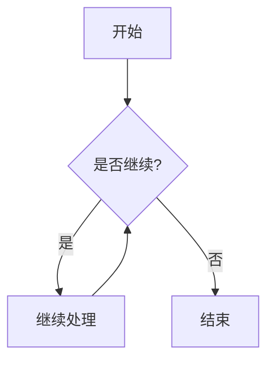
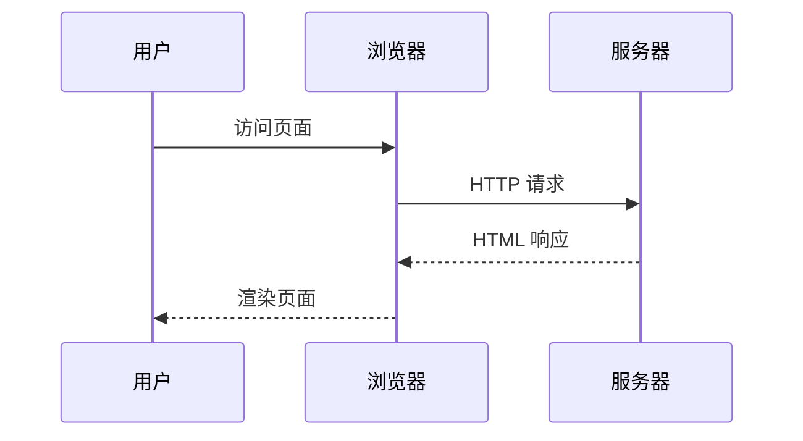

# Markdown 功能展示

本文展示 Lichtung 主题支持的各种 Markdown 扩展功能。

## 提示块（Alert Blockquotes）

使用 GitHub Flavored Markdown 的提示块语法：

> [!note]
> 这是一条 note 类型的提示。

> [!note]+
> 这条 note 默认展开。使用 `+` 控制默认状态。

> [!warning]
> 这是一条警告。

> [!tip]
> 这是一条小贴士。

> [!important]
> 这是一条重要提示。

> [!caution]
> 请小心操作！

## 代码块

普通代码块带有语言标签和复制按钮：

```python
def hello():
    print("Hello, Lichtung!")
    return 42
```

```javascript
// 点击代码块右上角的 copy 按钮复制代码
document.querySelector(".copybtn").addEventListener("click", function () {
  // 代码已被复制
});
```

## 代码块内联属性

```go {#hello-world .codeblock}
package main

import "fmt"

func main() {
    fmt.Println("Hello, 世界")
}
```

## Mermaid 图表

使用 mermaid 代码块绘制图表：





## 数学公式

行内公式：$E = mc^2$ 或 \(ax^2 + bx + c = 0\)

块级公式：

$$
\int_{-\infty}^{\infty} e^{-x^2} \, dx = \sqrt{\pi}
$$

$$
\frac{d}{dx} \left( \int_{a}^{x} f(t) \, dt \right) = f(x)
$$

## 表格

| 功能     | 支持 | 说明                    |
| -------- | ---- | ----------------------- |
| 提示块   | ✅   | `> [!note]` 语法        |
| Mermaid  | ✅   | 代码块指定 mermaid 语言 |
| 数学公式 | ✅   | `$` 或 `$$` 包裹        |
| 任务列表 | ✅   | `- [x]` 语法            |
| 删除线   | ✅   | `~~文本~~`              |
| 标记     | ✅   | `==文本==`              |

## 任务列表

- [x] 已完成的任务
- [x] 另一个已完成的任务
- [ ] 未完成的任务
- [ ] 待办事项

## 外部链接

这篇文章链接到了 [Hugo 官网](https://gohugo.io)。外部链接会自动添加出链图标并新窗口打开。

还有这个：[GitHub](https://github.com)。

## 内部链接

内部链接（指向本站其他页面）不会添加出链图标，而是被追踪为交叉链接：

- 跳转到[第一篇文章](/posts/first-post/)
- 跳转到[主题功能展示](/posts/theme-features/)
- 跳转到[数学公式展示](/docs/math-demo/)

这些内部链接会被自动记录到 CROSSLINKS 数据中，用于显示"出链"和"入链"。

## 图片


图片被 `<figure>` 包裹，点击在新窗口打开原图，支持延迟加载。

## 标题锚点

每个标题都会自动生成锚点链接。鼠标悬停在标题上可以看到 `#` 符号，点击可复制链接。

## 定义列表

Lichtung
: 德语，意为"林中空地"
: 海德格尔哲学概念

Hugo
: 一个 Go 语言编写的静态网站生成器
: 以速度闻名

## 脚注

这是一段需要注释的文字[^1]。这是另一段[^2]。

[^1]: 这是第一条脚注的内容。

[^2]: 这是第二条脚注，可以包含多段文字。

    第二段内容缩进即可。

## 额外扩展（Goldmark Extras）

~~这是删除的文本~~，~~这条也被删除了~~。

++这是插入的文本++。

==这是标记的文本==。

H~2~O 是水的化学式，E=mc^2^ 是质能方程。

上标支持：X^2^ + Y^2^ = Z^2^。下标支持：CH~3~CH~2~OH。
